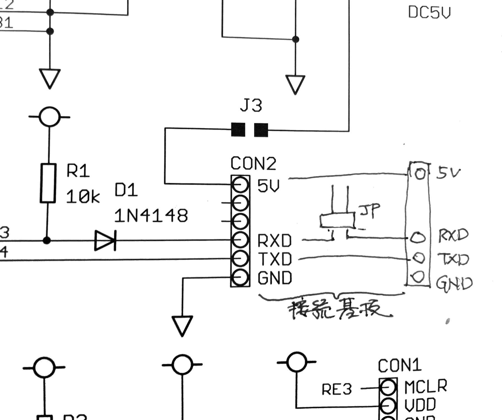
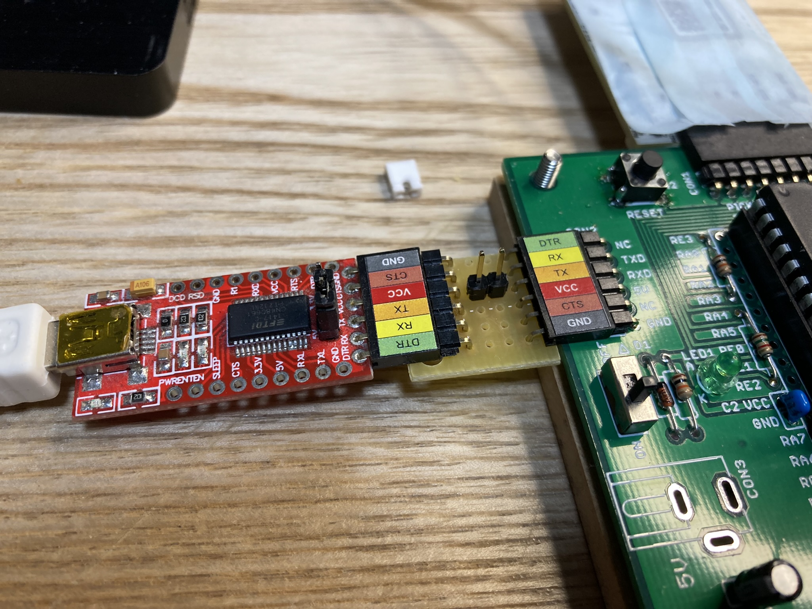
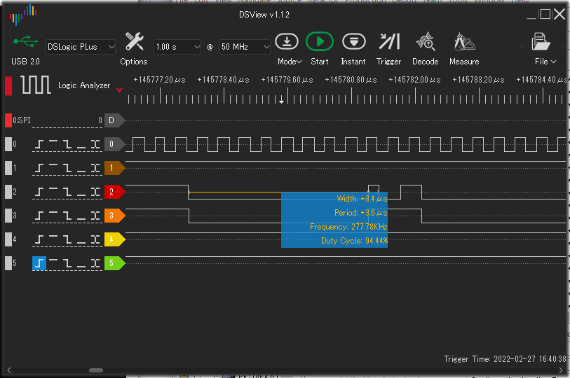
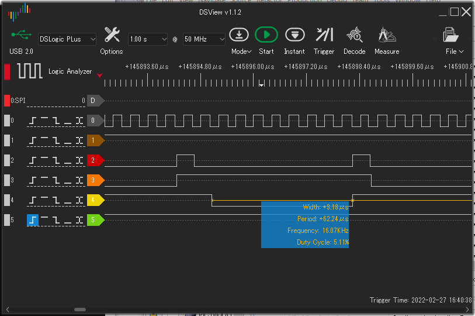
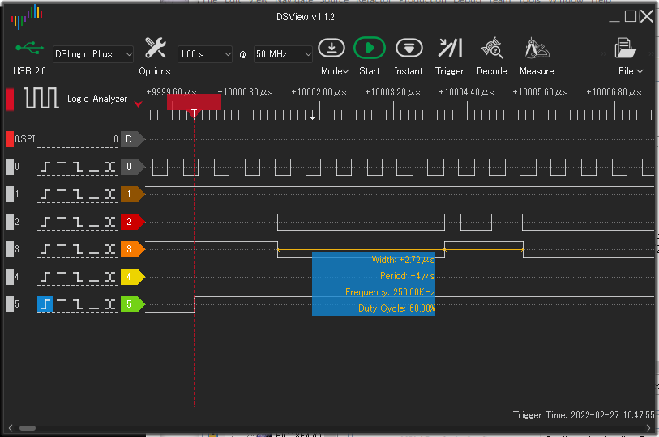
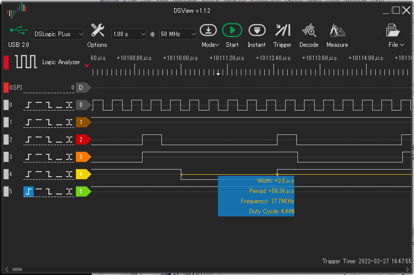
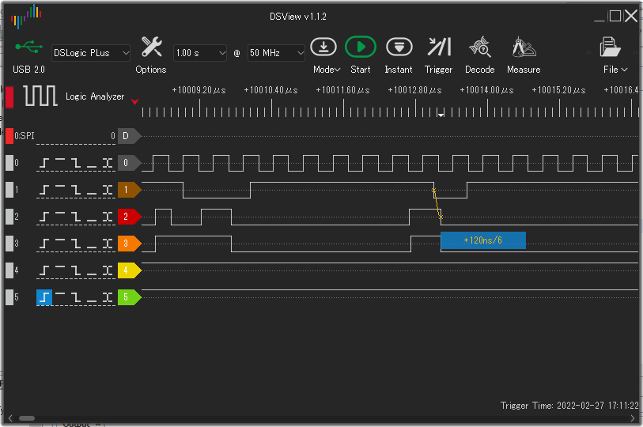
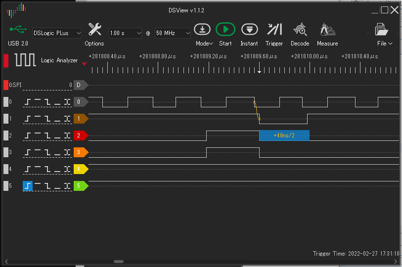

# EMUZ80 kuma version

Norihiro KumagaiによるEMUZ80.  オリジナルは電脳伝説さん(@vintagechips)の[EMUZ80](https://github.com/vintagechips/emuz80)です。

## EMUZ80の概要

* EMUZ80は、Z80 CPUをマイクロコントローラPIC18F47Q43で駆動する試みです。
* PIC18F47Q43のCLC(Configurable Logic Cell)を使い、Z80のメモリサイクルを待たせる/WAIT信号発生を外部回路なしで実現しており、わずか2チップでMicrosoft BASICを起動します。

## 取り組みの趣旨(Purpose)

### ソフトウェアループによる高速化

オリジナルは、メモリアクセス処理は割り込み駆動です。/WAIT 信号の下りエッジで割り込みハンドラを起動し、その中でメモリアクセス(BASICインタプリタとRAM)に対応します。

割り込みハンドラ呼び出しのためにはある程度のオーバヘッドが発生します(例: PCほかをスタックに退避する手間)。常時/WAIT出力を監視し、/WAIT出力がLになり次第メモリアクセス処理を解するようにすることで、このオーバーヘッドを回避できる可能性があります。この取り組みでは、この可能性を追求します。

### PIC18F47Q43に習熟する

秋月でDIP40ピンが240円(2022年2月末時点)という入手性の良さ。PIC18アーキテクチャではあるが、クロック64MHzと従来の3倍強の速さ。これらは今後共に暮らす強敵(とも)にふさわしい。この機会にMPLAB XとPIC18F47Q43を我が物としたい。

## やったこと

### ハードウェアの準備

githubの回路図どおりのハードウェアを用意します。手元に用意したハードには以下の変更を加えました。

* 2.1Φの電源アダプタジャックは搭載していません。
* シリアルの受信側(キーボード入力が来るほう)をUSBシリアルアダプタと切り離せるようにした。

<figure>
    
    <figcaption>USBシリアル接続基板の回路図</figcaption>
</figure>

<figure>
    
    <figcaption>USBシリアル接続基板</figcaption>
</figure>

これは、TESTピンを用意するためです。

ソフト側でON/OFFできるピンを1つ用意し、そのピンをソフトでON/OFFすることで、ロジックアナライザからソフトの処理時間と外部信号のタイミングを読み取ることができるようにします。

EMUZ80では、PICの40ピンすべて使い切っており未使用GPIOピンはありません。よって、今割り当て済だがなくてもなんとかなるピンを空けてTESTピンとして使用することを考えました。

Z80のメモリアクセスサイクルを追い込むときに、シリアル入力はなくてもなんとかなります。この追い込みでは、
* 無限NOP地獄…リードサイクルで0しか返さない、M1サイクルのタイミングを見る
* 無限01地獄…LXI B,XXXX命令を無限に繰り返す、メモリリードサイクルを見る
* 無限RST0地獄…リードサイクルで0xC7しか返さない、メモリライトサイクルのタイミングを見るために用いる

を使うつもりなので、シリアル入力は使用しないのです。最終的に、BASICインタプリタ起動を確認した時点でTESTピン出力を殺し、UART3のRX入力を復活させるようにします。

この基板の役割は、USBシリアルアダプタとRA7を分離することで、ロジックアナライザのプローブはPICそばの穴にピンを立てて、そこを取り付けます。

### MPLABXビルド環境の整備

Windows版をインストールし、ビルド・ターゲットの書き込みもWindows版IDEで行います。

ビルドしたHEXファイルの書き込みは、MPLAB Snapを使います。

MPLAB XもPIC18F47Q43も初挑戦なので、あらかじめ、スクラッチからプロジェクトを起こし、Lチカができるところまでを体験しておきました。

### githubリポジトリからのダウンロード

```
$ git clone https://github.com/vintagechips/emuz80.git
```
　手元にチェックアウトしておきます。ソースファイルは`main.c`1本だけなので簡単です。

> その後、自分のリポジトリを起こしました。https://github.com/tendai22/emuz80_kuma.git を参照ください。というかこのファイルを見ているということは、このリポジトリを見つけているはず。

### ビルドしてみる。

まっさらのプロジェクトを`PIC18F47Q43`, `Snap`で作り、空の`main.c`をチェックアウトした`main.c`を入れ替えます。これでビルドしてダウンロード、実行できます。

### TEST Pinを活かす

main関数内、初期化部分の最後に、RA7をTESTピンにする設定を書いてあります。

```
//#define TEST_PIN A7
#if defined(TEST_PIN)
    // RA7 as TEST pin ()
    TRISA7 = 0;     // A7 output
    LATA7 = 0;      // pin value is 0
    RA7PPS = 0;     // PPS as LATA7
#else
#undef TOGGLE
#define TOGGLE()
#endif //defined(TEST_PIN)
```

マクロ`TEST_PIN`を定義するとRA7はGPIO出力となり、UART3のRXとRA7は切り離されます。ハード的にRXとUSBシリアルのTXとは切り離しておいてください。つないだままだと地獄の謎データでTeraTerm画面が埋まってしまいます。

> TEST_PIN の値として`A7`を定義していますが、この値はまったく参照されません。気持ちだけです。

マクロ`TOGGLE()`をコード中で呼び出すと、そこでRA7が反転します。

現在のところ、/WAIT待ちループを抜け出たところと、/WAITを戻しデータバスを入力に切り替えた直後に1個ずつ入れてあります。ロジックアナライザでRA7を見ると、内部処理の開始と終了を知ることができます。

### 処理の概要

* /WAITピンがLになるまで待つ。Lになれば処理を開始する。
* CLCにより、/WAITピンがLになるということはメモリリードまたはライトサイクルであることは保証されている。
* /RD(RA5)がLならリードサイクルである。アドレスを読み込み、ROM/RAM/UART_CREG/UART_DREGの値をデータバスに出力する。
* /RDがHならライトサイクルである。/WRピンがLになるまで待ち、データバスからデータを読み込みRAM/UART_DREGに書き込む。
* 処理が終わると/WAITを戻す(Hを出力する)。/MREQがHに戻るのを待ち、すかさずデータバスを入力にする。

### 実行時間の比較

オリジナルの割り込み版とソフトループ版の比較。リードサイクルとライトサイクルを/MREQ==Lの間の時間で比較する。

以下のロジックアナライザ写真の信号割り当ては以下のとおりである。TEST Pin設定していないので、信号は常時Hである。
|||
|--|--|
|0(灰色)|Z80 CLK|
|1(茶色)|TEST Pin|
|2(赤色)|Z80 MREQ|
|3(橙色)|Z80 RD|
|4(黄色)|Z80 WR|
|5(緑色)|Z80 RESET|


### 割り込み版

オリジナルではZ80 CPUに供給されるクロック周波数は2.5MHzである。
M1サイクルで3.4us, メモリライトサイクルで3.18usであった。

<figure>
    
    <figcaption>割り込み版 M1サイクル(READ)</figcaption>
</figure>

<figure>
    
    <figcaption>割り込み版 メモリライトサイクル</figcaption>
</figure>

### ソフトループ版

クロックは2.0MHzに落としてある。
M1サイクルで2.7us, メモリライトサイクルで2.5usであった。若干速くなっている。

<figure>
    
    <figcaption>ソフトループ版 M1サイクル(READ)</figcaption>
</figure>

<figure>
    
    <figcaption>ソフトループ版 メモリライトサイクル</figcaption>
</figure>

### メモリサイクル終了時の処理

/WAITをHにするとZ80は実行を再開します。まず/MREQをHに戻し次のサイクルに入ります。PIC側では、次のサイクルが始まる前にデータバスを入力に戻しておかねばなりません。戻さないと、次のサイクルがライトサイクルの場合、データバスで出力が衝突する可能性があります。

PICが/WAITをHに戻してからどれぐらいの時間でZ80 CPUが/MREQを戻すかが読みにくいです。王道は/MREQを監視してHに戻ってからデータバスを入力に戻す(`TRISC=0xff`)のですが、Z80クロックが速くなってくると/MREQがHになったことを検知してからTRISCに代入する前に、Z80 CPUが次のメモリサイクルを開始してしまうことが生じます。

<figure>
    
    <figcaption>ソフトループ版 メモリリードサイクル終了点(クロック2MHz)</figcaption>
</figure>

クロック2.0MHzでのMREQ==Hから`TRISC=0xff`までの時間を表しています。波形1はTEST Pinであり、ここではリードサイクル最後に`TRISC=0xff`した直後にLに落としています。次にデータバスが出力状態になる場合の、基準時間はクロックT1の下りエッジから規定されています。最大値は60nsと決まっているのですが、最小値がいくらになるかの規定はありません。最悪を考えるとT1の下りエッジと同時に出力状態になることを想定します。よって、クロックT1の下りエッジより前にTEST Pinの下りエッジが来るようにすれば絶対安全です。

上記のロジックアナライザ波形では、クロックT1の下りエッジより前にTEST Pinの下りエッジがあるのでOKです。

クロック2.5MHzに上げると、TEST Pinの下りエッジが遅くなり、T1の下りエッジより後になってしまいます。
<figure>
    
    <figcaption>ソフトループ版 メモリリードサイクル終了点(クロック2.5MHz)</figcaption>
</figure>

40nsの遅延で厳密にはよろしくないのですが、実際のところは、
TEST PinがH->Lに設定するより60ns前に`TRISC=0xff`を実行している
ため、40ns遅延はぎりぎりOKと考えます。

ということで、上記2MHzで時間を測定しましたが、2.5MHzで再度測定すべきかもしれません。


